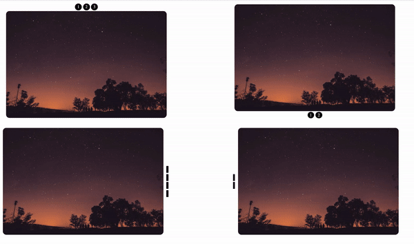

# react-nice-crousel

> simple but useful carousel for react

[](https://www.npmjs.com/package/react-nice-crousel) [](https://standardjs.com)

<div align="center">
    
</div>

## Install

```bash
npm install --save react-nice-crousel
```

## Usage

```jsx
import React from 'react'
import { ReactCarousel } from 'react-carousel'

const App = () => {
  return (
    <>
      <ReactCarousel
        slides={[
          'https://picsum.photos/600/400',
          'http://lorempixel.com/600/400/'
        ]} // array of images urls
        scrollDirection='yAxis' // xAxis , yAxis
        carouselBoxHeight={400} // image height and this must be the same
        carouselBoxWidth={600} // image width and this must be the same
        carouselNavButtonsPosition={'right'} // top , right , bottom , left
        carouselNavButtonsType={'dash'} // dash , number
        uniquePostfix='a' // should be unique for each instance
      />
    </>
  )
}
```

## Known Issues :

doesn't work as you expect on iPhone

## Inspired By :

https://codepen.io/chriscoyier/pen/XwbNwX

## License

MIT © [alithecodeguy](https://github.com/alithecodeguy)
